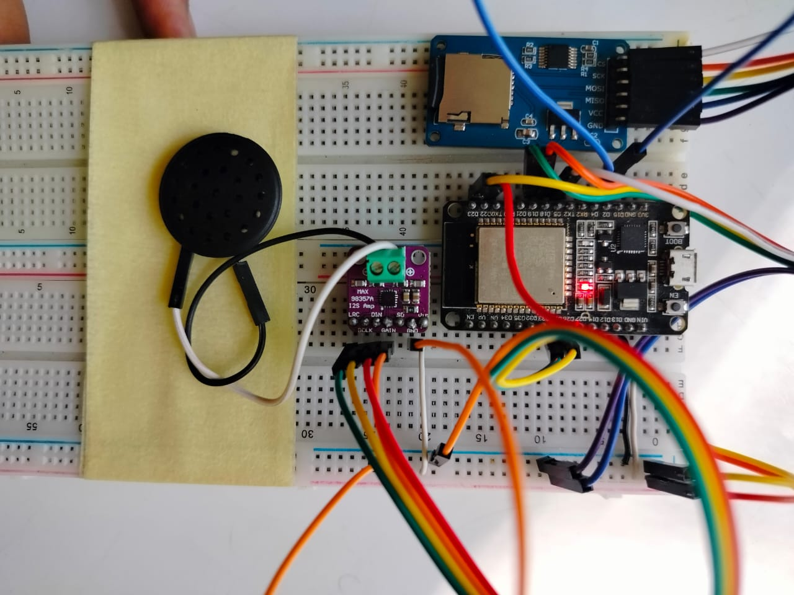
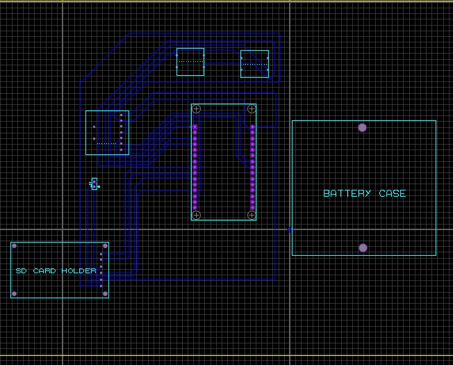
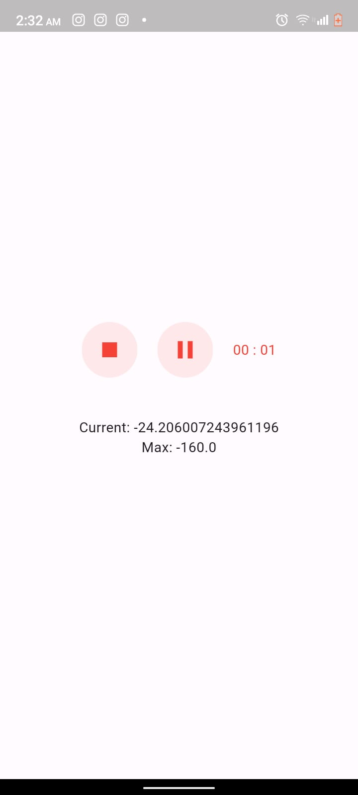

# VoiceBook Project

## Project Overview

The VoiceBook project is an innovative audio playback system designed to integrate cloud connectivity and mobile functionality with efficient power consumption. It progresses through three key phases, each enhancing the system's capabilities:

1. **Phase 1**: Integration of SD Card Reader with ESP32 for MP3 Playback
2. **Phase 2**: Integration with AWS Cloud Services for Remote File Access
3. **Phase 3**: Development of Mobile Application for Cloud File Upload

## Repository Contents

- [Phase_1 Report.pdf](Phase_1%20Report.pdf): Detailed report of Phase 1, including hardware setup, assembly, and testing results.
- [README.md](README.md): Project overview, setup instructions, and usage guidelines.
- [android_app.apk](android_app.apk): APK file for the Android mobile application.
- [circuit_setup.jpeg](circuit_setup.jpeg): Image of the hardware circuit setup.
- [esp32_code.txt](esp32_code.txt): Source code for the ESP32 microcontroller.
- [final_report.pdf](final_report.pdf): Comprehensive final report detailing all project phases, including figures and procedural blocks.
- [pcb_design.jpeg](pcb_design.jpeg): Image of the PCB design for the VoiceBook.
- [testing_video.mp4](testing_video.mp4): Video demonstrating the testing and functionality of the VoiceBook.

## Project Phases

### Phase 1: Integration of SD Card Reader with ESP32

**Objective:** Establish the basic hardware infrastructure for audio playback.

**Components:**
- **ESP32 Microcontroller:** Acts as the central processing unit, handling control and processing tasks. Chosen for its versatility and low power consumption.
- **SD Card Reader:** Provides external storage for audio files, allowing for a large library and easy access.
- **MAX98357A Audio Amplifier:** Drives the speaker to produce clear audio output from digital signals.
- **Battery:** A 55 mAh battery provides power, achieving around 6 hours of continuous operation. Further optimization could extend this to 24 hours.

**Assembly and Testing:**
- **Setup:** Components were assembled on a prototype board for initial testing.
- **SD Card Integration:** Libraries were used to read audio files from the SD card.
- **Performance:** Measured idle power consumption at approximately 80mA and demonstrated functionality with 10-15 audio messages per day.

**Documents:**
- [Phase_1 Report.pdf](Phase_1%20Report.pdf) (Detailed report of Phase 1)

**Visuals:**
- 

### Phase 2: Integration with AWS Cloud Services

**Objective:** Enhance the system's functionality by enabling remote file access and management through AWS.

**Components:**
- **AWS Cloud Services (AWS S3):** Provides cloud storage for audio files, allowing remote access and management.
- **HTTP Communication Protocol:** Ensures secure and efficient data transfer between the ESP32 and AWS.
- **Push Buttons:** Added to the design for user interaction, allowing actions such as downloading files and initiating playback.

**Features:**
- **Remote Access:** Users can store and retrieve audio files from anywhere with an internet connection.
- **User Interaction:** Push buttons facilitate intuitive control over the system.

**Documents:**
- [final_report.pdf](final_report.pdf) (Comprehensive report including Phase 2 details)

### Phase 3: Development of Mobile Application for Cloud File Upload

**Objective:** Expand functionality by developing mobile applications for audio recording and uploading to the cloud.

**Components:**
- **Cross-Platform Mobile Applications:** Native applications for Android and iOS to enable audio recording on mobile devices.
- **AWS SDK Integration:** Facilitates seamless upload of recorded audio files to AWS cloud storage.
- **PCB Design:** Designed to make the VoiceBook compact and refined, ensuring smooth commercial production.

**Features:**
- **Audio Recording:** Users can record audio directly from their mobile devices.
- **Cloud Upload:** Audio files are uploaded to AWS for remote access.
- **Compact Design:** PCB design ensures a sleek and functional final product.

**Documents:**
- [final_report.pdf](final_report.pdf) (Detailed report including Phase 3)
- [android_app.apk](android_app.apk) (APK file for the Android app)

**Visuals:**
- 
- 

## Mobile Application Screenshots

<table>
  <tr>
    <td>
      
    </td>
    <td>
      
    </td>
  </tr>
</table>

## Code and Configuration

- **ESP32 Code:** [esp32_code.txt](esp32_code.txt) (Source code for ESP32 microcontroller)

## Testing and Demonstration

- **Testing Video:** [testing_video.mp4](testing_video.mp4) (Demonstrates the functionality and performance of the VoiceBook)

## Future Work

- **Battery Optimization:** Improve battery life to achieve 24 hours or more.
- **PCB Finalization:** Complete PCB design for commercial production.
- **Mobile Application Expansion:** Enhance features and support for iOS platforms.

## License

The VoiceBook project is licensed under the MIT License. See [LICENSE](LICENSE) for details.

---

For further details and instructions, please refer to the [README.md](README.md) file.
